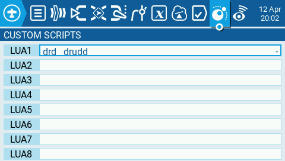
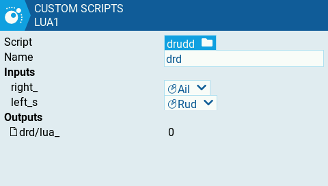
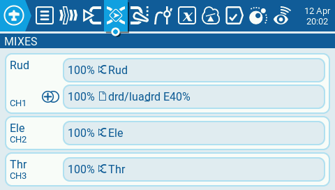
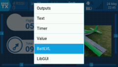
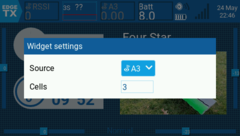
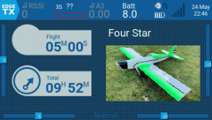
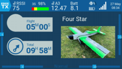
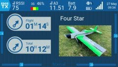

# Radiomaster TX16S Lua scripts

Lua script collection for Radiomaster TX16S running EdgeTX 2.7.1 (or higher)

> Free to use with the full understanding that you - the user - are doing something that can result in a crash that is dangerous and that you are responsible for your and others' safety!

## Useless

A useless tools script created as a test script for practice. Place the script and ```.png``` file in the ```/SCRIPTS/TOOLS``` directory of the radio's SD card, and access the script by pressing the SYS button to view the TOOLS page.  
The script displays a gray page with an icon, the current radio's code level, and a 'Click me' button. Click anywhere on the page to hear a low pitch tone, and click the button to hear a high pitch tone. Exit by pressing an holding the RTN button.


## Dual rudder stick

If you have a 3-channel RC model plane and you want your rudder stick to respond to both the right (CH1) and left (CH4) sticks then use this script together with a channel mix. You will need to enable Lua mix scripts on your radio by flashing the appropriate firmware, usually with ```-luamixer-``` in the name. If the Lua icon appears in the top settings bar to the left of the telemetry icon then you have Lua mix scripts installed and enabled.  



Place the script in the ```/SCRIPTS/MIXES``` directory on your SD card and you will be able to select it and assign it to one of the LUAn variable. Next configure the script's properties by providing a name and assigning the right and left input variables to the right and left sticks on channel 1 and 4.  



Finally, create a mix in MIXES that 'Adds' or 'Replaces' right stick's (CH1) input. This will ensure that if the Lua mix script is disabled by the radio's operating system, you will still maintain control using the right (CH1) stick.  



## Battery percent widget

This widget is useful if you have a flight battery voltage sensor and you want to use a simple color bar and percent indicator for the battery voltage level. Any sensor input that produces a voltage indication, typically A3, can be selected as an input. To use the widget copy the 'BattLVL/' directory and scripts 'main.lua' and 'loadable.lua' into the '/WIDGETS' folder on your radio.  
  
To add the widget press the TELE button and setup the widget as you normally would. This widget is called "BattLVL" and is best viewed on the top bar of the display.  



Once selected, or if you want to make changes later, edit the widget options. These options must be set to read your flight battery sensor value and to the correct battery size (1S, 2S, up to 4S).  



If the sensor is not present or not readable, or you selected the wrong battery size for the voltage that is read, the widget will display two question marks and an empty red rectangle.  



If everything is set correctly then your voltage sensor readout will be displayed.  





## Resources

- [EdgeTX 2.8 Lua Reference Guide](https://luadoc.edgetx.org/)
- [Lua: Documentation > Reference manual](https://www.lua.org/)
